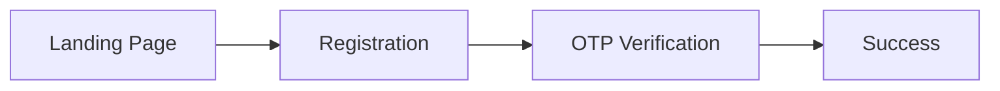

# LFN Frontend

A React + Vite frontend for LFN. It covers the user sign-up journey (registration, OTP verification, success confirmation) and includes an admin dashboard. The app currently runs against a mock API, so it can be developed and tested without a backend.

 **Status:** Active development. Some functionality still uses mock data.

## Features

- User registration
- OTP verification
- Registration success page
- Admin dashboard
- Mock API for local development
- Responsive layout
- Client-side routing with React Router
- Component-scoped styling with CSS Modules
- ESLint for code quality

## Tech Stack

| Area | Tool |
| --- | --- |
| UI library | React |
| Build tool | Vite |
| Language | JavaScript |
| Routing | React Router |
| Styling | CSS Modules |
| Linting | ESLint |

## Getting Started

### Prerequisites

- [Node.js](https://nodejs.org/) and npm
- [Git](https://git-scm.com/)

### Installation

```bash
# Clone the repository
git clone https://github.com/charles-edem/LFN-Frontend.git

# Move into the project
cd LFN-Frontend

# Install dependencies
npm install

# Start the development server
npm run dev
```

Vite will print the local URL when it starts, usually <http://localhost:5173>.

## Scripts

| Command | What it does |
| --- | --- |
| `npm run dev` | Starts the development server |
| `npm run build` | Creates a production build |
| `npm run preview` | Serves the production build locally |
| `npm run lint` | Runs ESLint |

## User Flow



The admin dashboard is a separate part of the app and is not part of this flow.

## Mock API

There is no production backend connected yet. API calls during development are handled by:

```
src/lib/mockApi.js
```

Because of this, data (including registrations and OTP behaviour) is simulated. When a real backend is ready, this file is the place to swap in real requests.

## Styling

Each page or component has its own CSS Module, so styles stay scoped and don't clash. Examples:

- `LandingPage.module.css`
- `SuccessPage.module.css`
- `AdminDashboard.module.css`

## Environment Variables

If you need to configure the app, create a `.env` file in the project root. Vite only exposes variables prefixed with `VITE_`.

```env
VITE_API_URL=http://localhost:3000
```

Never commit passwords, API keys, tokens, or other secrets. Make sure `.env` is listed in `.gitignore`.

## Roadmap

- [ ] Connect to a real backend in place of `mockApi.js`
- [ ] Finish and harden the admin dashboard

## Author

**Charles Edem** — [@charles-edem](https://github.com/charles-edem)
